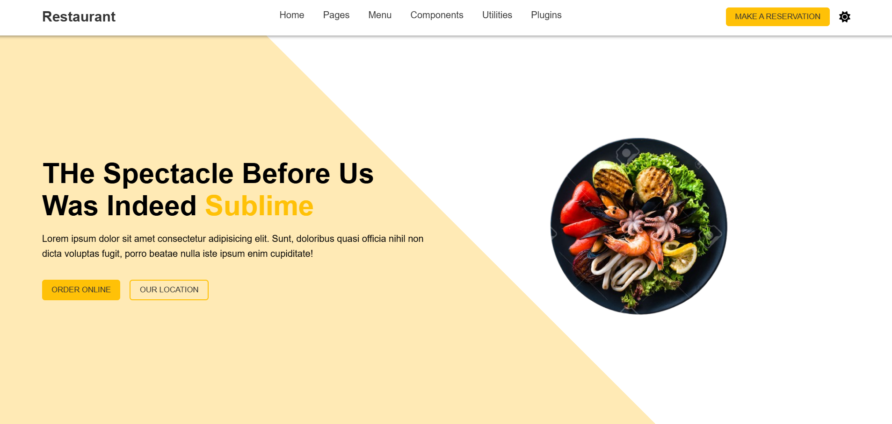
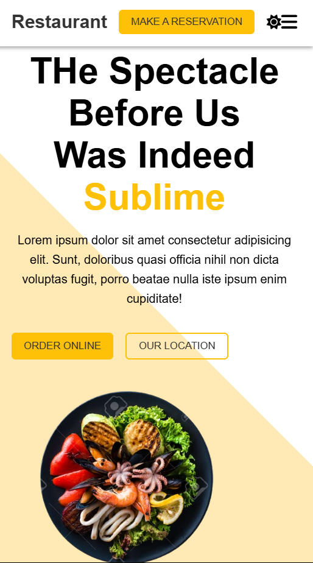
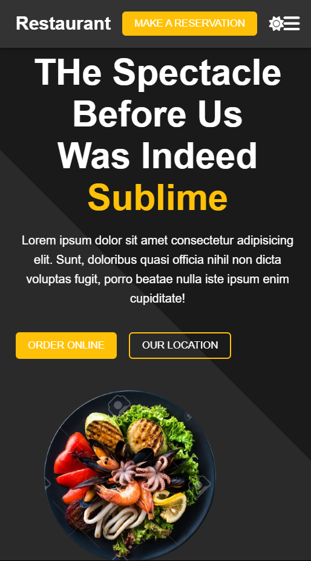

# 🍽️ Responsive Food Delivery Website
🛍️ **Click here** (elegant-otter-f6b57e.netlify.app) to explore the project.  
<br/>
This is a **responsive food delivery website** built using **HTML, CSS, and JavaScript**. The website allows users to explore food items, place orders, and locate the restaurant. It also features a **light/dark theme toggle** implemented using JavaScript. The design is fully responsive using CSS.

## 🌟 Features

- 🎨 **Light/Dark Mode Toggle** – Users can switch between themes.
- 📱 **Fully Responsive** – Optimized for mobile, tablet, and desktop views.
- ⚡ **Interactive UI** – Smooth navigation and well-structured layout.
- 🔥 **Modern Design** – Aesthetic and user-friendly interface.

## 📷 Screenshot

**Light Mode**

<br/>
**Dark Mode**

<br/>
**Small Screen**
<br/>



## 🚀 Technologies Used

- **HTML** – Structure of the website
- **CSS** – Styling and responsiveness
- **JavaScript** – Theme toggling and interactive elements

## 🎯 How to Use

1. Clone the repository:
   ```bash
   git clone https://github.com/your-username/your-repository-name.git
